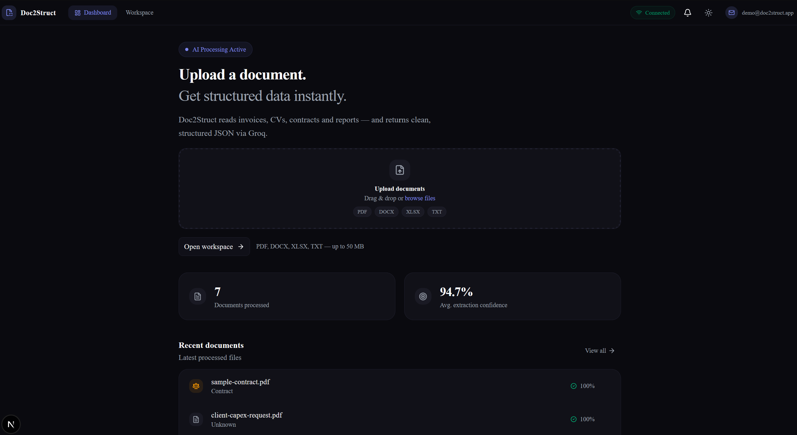
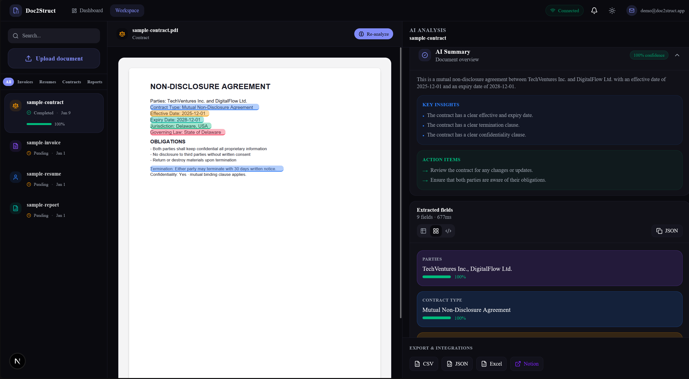
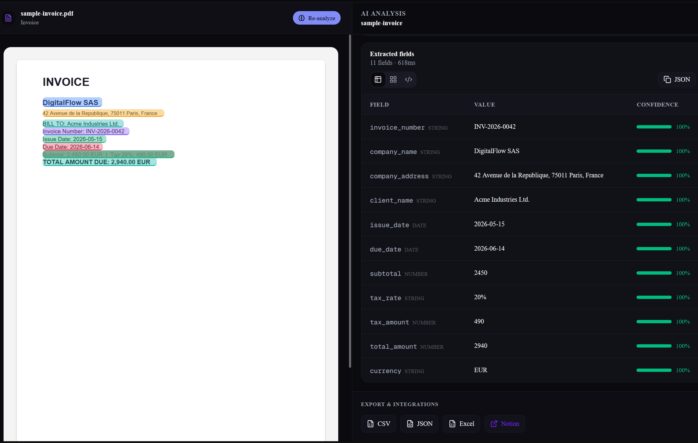

# Doc2Struct


AI-powered document intelligence — upload unstructured files, extract structured data, and export results in seconds.

**Live App:** [doc2-struct.vercel.app](https://doc2-struct.vercel.app)

<p align="center">
  
</p>

<p align="center">
  
</p>

<p align="center">
  
</p>

Doc2Struct is a SaaS-style document processing platform that turns PDFs, contracts, invoices, CVs, and internal business documents into validated, structured JSON. It combines a polished product UI with an API-first backend, schema-driven LLM extraction, and production-ready persistence.

Designed for:

- finance and accounting teams processing invoices,
- HR departments screening resumes at scale,
- legal and procurement teams reviewing contracts,
- operations teams digitizing internal forms and requests,
- pilots and POCs where enterprises want **their own documents** analyzed without manual data entry.

## Key Features

- AI document extraction
- Invoice, CV, contract and report support
- Structured JSON output
- CSV / JSON / Excel export
- Interactive PDF highlighting
- FastAPI + PostgreSQL backend

## Why This Project?

Organizations still lose hours re-keying data from PDFs into ERPs, spreadsheets, and ticketing systems.

Doc2Struct helps teams:

- upload documents without triggering immediate processing noise,
- run AI extraction on demand with visible progress,
- preview PDFs with field-level highlights,
- review confidence scores and AI summaries before export,
- export to **CSV, JSON, or Excel** for downstream systems,
- keep a persistent document history (PostgreSQL on Neon).

The product is intentionally split into a **Dashboard** (entry point + upload) and a **Workspace** (3-column analysis environment) — a flow familiar to enterprise SaaS users.

## Why Not Just ChatGPT?

Unlike ad-hoc prompting in a chat UI, Doc2Struct provides:

- deterministic document-type schemas (invoice, resume, contract, report),
- automatic classification of unknown enterprise documents,
- structured field outputs with per-field confidence,
- persistent document storage and retrieval,
- REST API for integration into existing tools,
- export pipelines ready for finance / BI / ops workflows,
- a dedicated workspace UX instead of copy-paste from chat.

## Features

### Product UX

- **Dashboard** ([doc2-struct.vercel.app](https://doc2-struct.vercel.app)) — upload entry point, KPIs, recent documents
- **Workspace** ([doc2-struct.vercel.app/workspace](https://doc2-struct.vercel.app/workspace)) — document list, PDF preview, AI analysis panel
- Drag-and-drop upload (PDF, DOCX, XLSX, TXT — up to 50 MB)
- Manual **Analyze** workflow with live scanning feedback
- PDF preview with extracted-field highlights (pdf.js)
- Light / dark theme
- Backend connection status in the top navigation
- Sample documents for demos + optional enterprise test PDFs

### AI & Extraction

- Document classification and field extraction via **Groq** (Llama models)
- Typed schemas per document category
- Summary, key insights, action items, and warnings
- Global confidence score and per-field confidence
- Client-side Groq key override (optional) or server-side key

### API & Data

- FastAPI REST API with OpenAPI docs
- Upload → pending → analyze → processing → completed lifecycle
- PostgreSQL persistence (Neon) with in-memory fallback for local dev
- List, retrieve, delete documents
- Platform statistics endpoint

### Export

- JSON (full extraction payload)
- CSV (tabular fields)
- Excel (`.xlsx`)

## Tech Stack

| Layer | Technology |
| --- | --- |
| **Frontend** | Next.js 16, React 19, TypeScript, Tailwind CSS 4, shadcn/ui, Framer Motion |
| **PDF Preview** | pdf.js (pdfjs-dist) |
| **Backend** | FastAPI, Pydantic, Uvicorn, SQLAlchemy async |
| **Database** | Neon PostgreSQL (asyncpg) |
| **AI** | Groq OpenAI-compatible API (Llama 3.1 / 3.3) |
| **Parsing** | pdfplumber, PyMuPDF, python-docx, pandas, openpyxl |
| **Deployment** | [Vercel](https://doc2-struct.vercel.app) (frontend), [Railway](https://doc2struct-production.up.railway.app) (API) |

## Product Flow

```text
Dashboard
  → Upload document
  → Redirect to Workspace (document pre-selected)
  → Click Analyze
  → Background AI extraction (Groq)
  → Review fields + PDF highlights
  → Export CSV / JSON / Excel
```

## Key Design Decisions

- **API-first backend** — the UI is a client; integrations can call the same endpoints
- **Manual analyze by default** — upload stores the file; extraction runs only when the user requests it (cost control + predictable UX)
- **Optimistic UI + polling** — handles async background processing and Railway cold starts
- **Schema-driven extraction** — prompts and field contracts per document type, not free-form text
- **DB with graceful fallback** — works locally without `DATABASE_URL` (in-memory store)
- **Sample document catalog** — demo PDFs for sales/POC without requiring client data on day one
- **Separate Dashboard and Workspace routes** — mirrors enterprise SaaS onboarding vs. power-user flows

## Setup

### Prerequisites

- **Node.js** 20+
- **Python** 3.11+
- **Groq API key** from the [Groq Console](https://console.groq.com/keys)
- **Neon PostgreSQL** URL (optional for local dev — in-memory fallback works)

### Installation

**Backend**

```powershell
cd backend
python -m venv venv
.\venv\Scripts\Activate.ps1
pip install -r requirements.txt
copy .env.example .env
```

Set `GROQ_API_KEY` in `.env`. Add `DATABASE_URL` for persistent storage.

**Frontend**

```powershell
cd frontend
npm install
copy .env.local.example .env.local
```

Create `frontend/.env.local`:

```env
# Local development
NEXT_PUBLIC_API_URL=http://localhost:8000

# Production (Vercel)
# NEXT_PUBLIC_API_URL=https://doc2struct-production.up.railway.app
```

### Environment Variables

**Backend** (`backend/.env.example`)

| Variable | Description |
| --- | --- |
| `GROQ_API_KEY` | Groq API key for document extraction |
| `GROQ_MODEL` | Model name (default: `llama-3.3-70b-versatile`) |
| `DATABASE_URL` | Neon PostgreSQL connection string (optional locally) |
| `FRONTEND_URL` | Allowed CORS origin (e.g. `https://doc2-struct.vercel.app`) |
| `MAX_FILE_SIZE_MB` | Upload size limit (default: 50) |

**Frontend** (`frontend/.env.local`)

| Variable | Description |
| --- | --- |
| `NEXT_PUBLIC_API_URL` | FastAPI base URL |

## Quick start

**Option A — Windows launcher**

```powershell
.\start.bat
```

Opens the frontend at `http://localhost:3000` and the backend at `http://localhost:8000` (if `backend/venv` exists).

**Option B — Manual**

Terminal 1 — API:

```powershell
cd backend
.\venv\Scripts\Activate.ps1
uvicorn main:app --reload --port 8000
```

Terminal 2 — UI:

```powershell
cd frontend
npm run dev
```

**Production**

| Service | URL |
| --- | --- |
| Dashboard | https://doc2-struct.vercel.app |
| Workspace | https://doc2-struct.vercel.app/workspace |
| API | See [API](#api) section |

**Local development**

| Service | URL |
| --- | --- |
| Dashboard | http://localhost:3000 |
| Workspace | http://localhost:3000/workspace |
| API (local) | http://localhost:8000 — Swagger at `/docs` |

## Demo Dataset

Sample PDFs ship with the frontend under `frontend/public/samples/`:

| File | Purpose |
| --- | --- |
| `sample-invoice.pdf` | Invoice extraction demo |
| `sample-resume.pdf` | Resume / CV demo |
| `sample-contract.pdf` | Contract clauses demo |
| `sample-report.pdf` | Financial report demo |
| `client-capex-request.pdf` | Enterprise CAPEX internal form (manual upload) |
| `client-it-access-request.pdf` | IT license & access request form (manual upload) |

Regenerate samples (optional):

```powershell
cd samples
python generate_all_samples.py
python generate_enterprise_samples.py
```

## API

**Production base URL:** `https://doc2struct-production.up.railway.app`

| Resource | URL |
| --- | --- |
| **Swagger UI (interactive docs)** | [doc2struct-production.up.railway.app/docs](https://doc2struct-production.up.railway.app/docs) |
| Health check | [doc2struct-production.up.railway.app/health](https://doc2struct-production.up.railway.app/health) |
| API root | [doc2struct-production.up.railway.app](https://doc2struct-production.up.railway.app) |

### Endpoints

```text
GET    /health
GET    /api/v1/stats
GET    /api/v1/documents/
POST   /api/v1/documents/upload
POST   /api/v1/documents/{id}/analyze
GET    /api/v1/documents/{id}
GET    /api/v1/documents/{id}/extraction
POST   /api/v1/documents/{id}/export
DELETE /api/v1/documents/{id}
```

## Deployment

| Component | Target | URL / notes |
| --- | --- | --- |
| Frontend | Vercel | [doc2-struct.vercel.app](https://doc2-struct.vercel.app) — Root Directory: `frontend` |
| Backend | Railway | Root Directory: `backend` — API docs in [API](#api) section |
| Database | Neon | Serverless PostgreSQL |

**Vercel:** `NEXT_PUBLIC_API_URL=https://doc2struct-production.up.railway.app`  
**Railway:** `FRONTEND_URL=https://doc2-struct.vercel.app` (CORS)

## Roadmap

- OAuth / SSO and team workspaces
- Webhook notifications on analysis complete
- Gmail / SharePoint / Google Drive connectors
- Custom extraction schemas per customer
- Prompt versioning and evaluation harness
- Audit logs and GDPR retention policies
- Billing and usage metering for SaaS monetization

## Architecture

```text
Next.js UI  →  FastAPI API  →  Groq (LLM extraction)  →  PostgreSQL (Neon)
                     ↓
              Document parsing (PDF, DOCX, XLSX, TXT)
```

Monorepo layout: `frontend/` (Next.js app), `backend/` (FastAPI), `samples/` (PDF generators).

```text
Upload → parse → classify & extract → store → preview + export
```

## What This Project Demonstrates

- Full-stack SaaS architecture
- LLM-powered document extraction
- Structured data pipelines
- Production-oriented deployment
- Enterprise-focused UX
